#  # Project 2 - Ames Housing Data and Kaggle Challenge

## Contents:

- [Background](#Background)
- [Problem statement](#Problem-Statement)
- [Datasets](#Datasets)
- [Data dictionary](#Data-dictionary)
- [Executive Summary](#Executive-Summary)
- [Data cleaning](#Data-cleaning)
- [Exploratory Data Analysis & Feature engineering](#Exploratory-Data-Analysis-&-Feature-engineering)
- [Modelling](#Modelling)
- [Summary](#Summary)
- [LINEM Assumptions](#LINEM-Assumptions)
- [Accuracy plot of predicted value](#Accuracy-of-model)
- [Conclusion](#Conclusion)
- [Citation](#Citations)

## Background

Real estate transactions often involve a significant amount of money, often representing the most expensive transaction a person enters into.1 One of the reasons a dispute may arise is **Property Condition Misrepresentation**. During the sale of a property, the seller will be presented with a property disclosure statement (PDS). This form is used to reveal any pertinent information regarding the condition of the property. The seller should disclose any defects that were not repaired so that the buyer is fully aware of the real condition of the house. They should also present any documentation regarding repairs they made to address the issue. However, revealing certain defects may prevent the sale of the property or reduce the price of a property.Some sellers may omit known defects from the disclosure agreement in an effort to sell their property at a higher price. This intentional omission means that the seller misrepresented the condition of the property to buyers in a fraudulent manner.2 Clients who discover defects after signing the papers will be quick to blame the real estate agent.3

Real life events:
    
In 2008, Marty Ummel feels she paid too much for her house. So do millions of other people who bought at the peak of the housing boom. What makes Ms. Ummel different is that she is suing her agent, saying it was all his fault.4

And in 2016, a lawsuit brought by Lincoln and Leslie Beauregard against their realtor, Anna Riley.One of the reasons was valuing and listing the property at too high a price.5

---

## Problem Statement

Misrepresentation of house sale value is a common misunderstanding between homeowners and real estate agents creating dissatisfaction on either party. Real estate agents often quote house values based on their experience.To reduce the possiblity of realtors being blamed due to inaccurate house sale value, GA’s real estate has consulted the data science team that I am in, to create and train a regression model to improve the accuracy of housing sale value in Ames, Iowa to at least 85% in the R2 score. 

---

## Datasets

These are the datasets used for this project.
* [`train.csv`](./datasets/train.csv): Training Data set contains information from the Ames Assessor’s Office used in computing assessed values for individual residential properties sold in Ames, IA from 2006 to 2010.
* [`test.csv`](./datasets/test.csv): Test Data set contains information from the Ames Assessor’s Office used in computing assessed values for individual residential properties sold in Ames, IA from 2006 to 2010.
* [`final_train.csv`](./datasets/final_train.csv): Cleaned dataset for train.csv and to be used for modelling.
* [`final_test.csv`](.data/sets/final_test.csv): Cleaned dataset for test.csv and to be use for modelling.
---

## Data dictionary

### Original train and test set dictionary

[Data Dictionary](http://jse.amstat.org/v19n3/decock/DataDocumentation.txt)

The variables were split into:
##### Quantitative: Quantify things by considering numerical values and make it countable in nature .6
    - Discrete: Numerical values which fall under intergers or whole number.
    
    - Continuous: Numerical values that are fractional numbers
    
##### Qualitative: Data that can't be counted or measure easily using numbers and therefore divided into categories 7
    - Ordinal: Types of values that have natural ordering while maintaining their class of values.
    
    - Nominal: Set of values that don't possess a natural ordering. 

---

## Executive Summary

The data provided had a lot of missing data, most of the data were replaced with 0 and 'NA' except for a variable 'lot frontage' as it is possible to have 0 frontage and bias to provide a value for it, therefore I have dropped it. After cleaning, I proceeded with EDA: removed outliers, mapping for ordinal variables, creating dummies for nominal variables and look at the top 5 correlated variables and did visualizations on the variables. A model was created using the clean training set to get a sensing of what the score of the model would be with all the predictor variables included. From there, the number of predictors were narrowed down to predictors with above 0.5/below -0.5 correlation against sale price. Some predictors were further eliminated as they were fairly correlated. From there, 4 models were created and one with an accuracy of 90%.

---

## Data cleaning

#### This is how null values were dealt with for both data sets:

|Column|Column dictionary|Replaced value|Reason| 
|---|---|---|---|
|alley|Type of alley access to property.|'NA'|From the data description, NA represents no alley access.|
|mas_vnr_type|Masonry veneer type|'None'|From the data description, None represents no masonry veneer type.|
|mas_vnr_area|Masonry veneer area in square feet|0| There is a similar count of null values,22, for masonry veneer area and mason veneer type, therefore assumption of 22 observations to have no masonry veneer area and represented by 0.|
|bsmt_qual|Height of the basement|'NA'|From the data description, NA represents no basement|
|bsmt_cond|General condition of the basement|'NA'|From the data description, NA represents no basement|
|bsmt_exposure|Walkout or garden level basement walls|'NA'|From the data description, NA represents no basement|
|bsmtfin_type_1|Quality of basement finished area|'NA'|From the data description, NA represents no basement|
|bsmtfin_sf_1|Type 1 finished square feet|0|Np.nan was replaced by 0 , representing that there is no basement|
|bsmtfin_type_2|Quality of second finished area (if present)|'NA'|From the data description, NA represents no basement|
|bsmtfin_sf_2|Type 2 finished square feet|0|Np.nan was replaced by 0 , representing that there is no basement|
|bsmt_unf_sf|Unfinished square feet of basement area|0|Np.nan was replaced by 0 , representing that there is no basement|
|total_bsmt_sf|Total square feet of basement area|0|Np.nan was replaced by 0 , representing that there is no basement|
|bsmt_full_bath|Basement full bathrooms|0|Np.nan was replaced by 0 , representing that there is no basement and hence no basement bathrooms.|
|bsmt_half_bath|Basement half bathrooms|0|Np.nan was replaced by 0 , representing that there is no basement and hence no basement bathrooms.|
|fireplace_qu|Fireplace quality|'NA'|From the data description, NA represents no fireplace|
|garage_cars|Size of garage in car capacity|0|Np.nan was replaced by 0, representing that there is no garage and hence unable to measure the car capacity in the garage|
|garage_area|Size of garage in square feet|0|Np.nan was replaced by 0, representing that there is no garage and hence unable to get a garage area|
|garage_qual|Garage quality|'NA'|From the data description, NA representing no garage|
|garage_cond|Garage condition|'NA'|From the data description, NA representing no garage|
|pool_qc|Pool quality|'NA'|From the data description, NA representing no pool|
|fence|Fence quality|'NA'|From the data description, NA representing no fence|
|misc_feature|Miscellaneous feature not covered in other categories|'NA'|From the data description, NA representing no miscellaneous feature|
|lot_frontage|Linear feet of street connected to property|Dropped| There were too many missing value for this variable and it will be bias to input as 0 or mean as it is possible to have 0 frontage|
|electrical|Electrical system|'SBrkr'|There has to be an electrical system for every household, therefore I search for the mode of the dataset and replace it with 'SBrk'|

---

## Exploratory Data Analysis & Feature engineering

#### Outliers

From the data documentation of ameshousing.txt, Dean De Cock mentioned the following:

SPECIAL NOTES:
There are 5 observations that an instructor may wish to remove from the data set before giving it to students (a plot of SALE PRICE versus GR LIV AREA will indicate them quickly). Three of them are true outliers (Partial Sales that likely don’t represent actual market values) and two of them are simply unusual sales (very large houses priced relatively appropriately). **I would recommend removing any houses with more than 4000 square feet from the data set (which eliminates these 5 unusual observations) before assigning it to students.**8

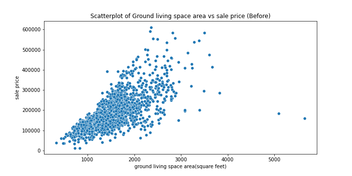
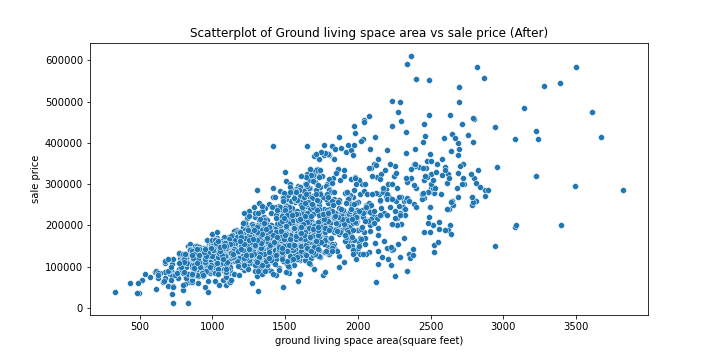

#### Ranking Ordinal variables

Ordinal features for the training dataset were ranked with 1 being the lowest, ascending score would mean that it is of a better tier and 0 would indicate that the feature is 'NA'.

|Column|Description|Mapped values|
|---|---|---|
|lot_shape|General shape of property|'IR3'(Irregular): 1, 'IR2'(Moderately Irregular): 2, 'IR1'(Slightly irregular): 3,'Reg'(Regular): 4|
|utilities  |Type of utilities available|'ELO'(Electricity only): 1, 'NoSeWa'(Electricity and Gas Only): 2, 'NoSewr'(Electricity, Gas, and Water (Septic Tank) :3, 'AllPub'(All public Utilities (E,G,W,& S): 4|
|land_slope  |Slope of property|'Sev'(Severe Slope): 1,'Mod'(Moderate Slope): 2, 'Gtl'(Gentle slope): 3|
|exter_qual  |Evaluates the quality of the material on the exterior|'Po'(Poor): 1, 'Fa'(Fair): 2, 'TA'(Average): 3, 'Gd'(Good): 4, 'Ex'(Excellent): 5|
|exter_cond  |Evaluates the present condition of the material on the exterior|'Po'(Poor): 1, 'Fa'(Fair): 2, 'TA'(Average/Typical): 3, 'Gd'(Good): 4, 'Ex'(Excellent): 5|
|bsmt_qual  |Evaluates the height of the basement|'NA'(No basement): 0 , 'Po'(Poor): 1, 'Fa'(Fair): 2, 'TA'(Average/Typical): 3, 'Gd'(Good): 4, 'Ex'(Excellent): 5|
|bsmt_cond  |Evaluates the general condition of the basement|'NA'(No basement): 0 , 'Po'(Poor - Severe cracking, settling, or wetness): 1, 'Fa'(Fair - dampness or some cracking or settling): 2, 'TA'(Typical - slight dampness allowed): 3, 'Gd'(Good): 4, 'Ex'(Excellent): 5|
|bsmt_exposure  |Refers to walkout or garden level walls|'NA'(No Basement):0, 'No'(No Exposure): 1, 'Mn'(Mimimum Exposure): 2, 'Av'(Average Exposure (split levels or foyers typically score average or above)): 3, 'Gd'(Good Exposure): 4|
|bsmtfin_type_1  |Rating of basement finished area|'NA'(No basment): 0 , 'Unf'(Unfinshed): 1, 'LwQ'(Low Quality): 2, 'Rec'(Average Rec Room): 3, 'BLQ'(Below Average Living Quarters): 4, 'ALQ'(Average Living Quarters): 5, 'GLQ'(Good Living Quarters): 6|
|bsmtfin_type_2  |Rating of basement finished area (if multiple types)|'NA'(No basment): 0 , 'Unf'(Unfinshed): 1, 'LwQ'(Low Quality): 2, 'Rec'(Average Rec Room): 3, 'BLQ'(Below Average Living Quarters): 4, 'ALQ'(Average Living Quarters): 5, 'GLQ'(Good Living Quarters): 6|
|heating_qc  |Heating quality and condition|'Po'(Poor): 1, 'Fa'(Fair): 2, 'TA'(Average/Typical): 3, 'Gd'(Good): 4, 'Ex'(Excellent): 5|
|kitchen_qual  |Kitchen quality|'Po'(Poor): 1, 'Fa'(Fair): 2, 'TA'(Average/Typical): 3, 'Gd'(Good): 4, 'Ex'(Excellent): 5|
|functional  |Home functionality (Assume typical unless deductions are warranted)|'Sal'(Salvage only) : 1, 'Sev'(Severely Damaged): 2, 'Maj2'(Major Deductions 2):3 , 'Maj1'(Major Deductions 1): 4, 'Mod'(Moderate Deductions): 5, 'Min2'(Minor Deductions 2): 6, 'Min1'(Minor Deductions 1): 7, 'Typ'(Typical Functionality): 8|
|fireplace_qu  |Fireplace quality|'NA'(No Fireplace): 0 , 'Po'(Poor - Ben Franklin Stove): 1, 'Fa'(Fair - Prefabricated Fireplace in basement): 2, 'TA'(Average - Prefabricated Fireplace in main living area or Masonry Fireplace in basement): 3, 'Gd'(Good - Masonry Fireplace in main level): 4, 'Ex'(Excellent - Exceptional Masonry Fireplace): 5|
|garage_finish  |Interior finish of the garage|'NA'(No Garage): 0 , 'Unf'(Unfinished): 1, 'RFn'(Rough Finished): 2, 'Fin'(Finished): 3|
|garage_qual  |Garage quality|'NA'(No Garage): 0 , 'Po'(Poor): 1, 'Fa'(Fair): 2, 'TA'(Average/Typical): 3, 'Gd'(Good): 4, 'Ex'(Excellent): 5|
|garage_cond  |Garage condition|'NA'(No Garage): 0 , 'Po'(Poor): 1, 'Fa'(Fair): 2, 'TA'(Average/Typical): 3, 'Gd'(Good): 4, 'Ex'(Excellent): 5|
|paved_drive  |Paved driveway|'N'(Dirt/Gravel): 1, 'P'(Partial Pavement): 1, 'Y'(Paved): 2|
|pool_qc  |Pool quality|'NA'(No Pool): 0 , 'Fa'(Fair): 1, 'TA'(Average/Typical): 2, 'Gd'(Good): 3, 'Ex'(Excellent): 4|
|fence  |Fence quality|'NA'(No Fence): 0 , 'MnWw'(Minimum Wood/Wire): 1, 'GdWo'(Good Wood): 2, 'MnPrv'(Minimum Privacy): 3, 'GdPrv'(Good Privacy): 4|

#### Dummify Nominal variables

|Columns|Description|
|---|---|
|ms_subclass|Identifies the type of dwelling involved in the sale|
|ms_zoning|Identifies the general zoning classification of the sale|
|street|Type of road access to property|
|land_contour|Flatness of the property|
|lot_config|Lot configuration|
|neighborhood|Physical locations within Ames city limits|
|condition_1|Proximity to various conditions|
|condition_2|Proximity to various conditions (if more than one is present)|
|bldg_type|Type of dwelling|
|house_style|Style of dwelling|
|roof_style|Type of roof|
|roof_matl|Roof material|
|exterior_1st|Exterior covering on house|
|exterior_2nd|Exterior covering on house (if more than one material)|
|mas_vnr_type|Masonry veneer type|
|foundation|Type of foundation|
|heating|Type of heating|
|central_air|Central air conditioning
|electrical|Electrical system|
|garage_type|Garage location|
|misc_feature|Miscellaneous feature not covered in other categories|
|sale_type|Type of sale|
|alley|Type of alley access to property|

After mapping and dummifying were done, I picked out the top 5 correlated variables against sale price.

|Columns|Correlation|
|---|---|
|overall_qual|0.803462|
|gr_liv_area|0.719463|
|exter_qual|0.715048|
|kitchen_qual|0.694295|
|total_bsmt_sf|0.665116|

#### Visualizations of the top 5 correlated variables

###### Bar chart on Overall quality, correlation: 0.803462
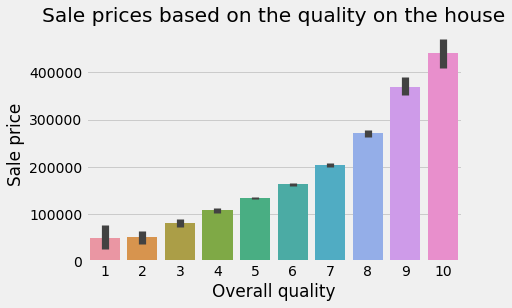

###### Scatterplot on Living area space, correlation: 0.719463
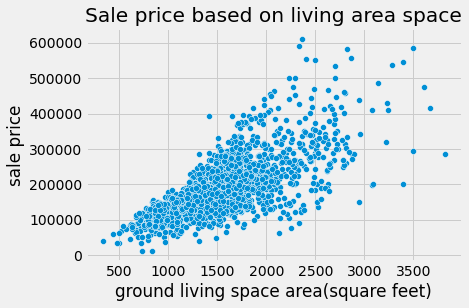

###### Bar chart on Exterior quality, correlation: 0.715048
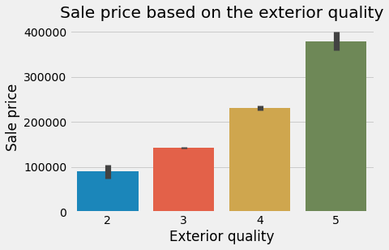

###### Bar chart on Kitchen quality, correlation:  0.694295
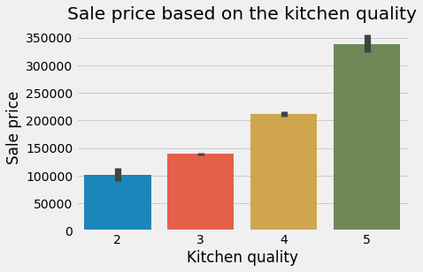

###### Scatterplot on basement area space, correlation: 0.665116
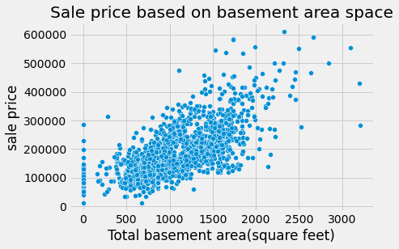

From the top 5 correlated features, we can see both area space and quality are dominating the ranks. 

Quality of house definitely plays a huge role in the sale price as we can see from the charts above, there is a huge jump of sale price on overall quality(first chart)from a score of 7 onwards, which could be almost a spike of approximately 100,000.

For the area space, you can see that there is an upward trend. With larger space, prices are more expensive.
However, if we look at the basement graph, it is also possible to have houses priced at 200,000 to 300,000 with no basement.
This could be due to other variables such as the age of the house and quality.

---

## Modelling

#### The beginning of modelling

A model was created using all the variables we have cleaned and feature enginnered to get some sensing, this was the results.

#### Interpretation

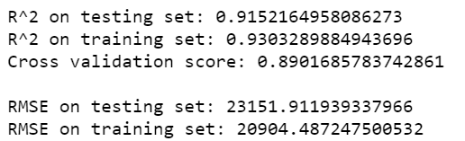

Lets compare the R^2 of both tests:
- The R^2 score for both sets are very high, 0.91 for testing and 0.93 for training.
- The score represents that 91% / 93% of _saleprice_ is explained by the _x_-variables in our model.
- This is expected as we used all of the columns provided.
- The Test and Cross Val are pretty similar, which indicates that it is a representative of the test set.

Let us look at the Root Mean Square Error,RMSE. 
- RMSE represents the (approximately) average distance from the predicted value.
- The RMSE for the training set is USD 20,904 (rounded), this means that we have an error of the RMSE from the mean which is USD 181,479(rounded).
- The RMSE for the test set is slightly higher at USD 23,151.
- The goal is to make RMSE as low as possible so that the model will have a better accuracy of the saleprice.

The interpretation for variables is as follows:
- The variables were catergorized into:
    1. Discrete:
        - Example: bsmt_full_bath', 3300.996749152159
        - Holding all other variables constant, for every full bathroom in the basement, saleprice will increase by USD 3300
    2. Continuous:
        - Example: 'lot_area', 0.8791804911014491
        - Holding all other variables constant, for every unit increase in lot size, saleprice will increase by USD 0.87
    3. Ordinal: (Ordinal variables are variables with a natural order. We ranked the variables with 0 being not applicable and start with 1 being the lowest tier category) 
        - Example: 'lot_shape', 1728.2457675446183
        - Holding all other variables constant, for each increase in the tier, saleprice will increase by USD 1728.24
    4. Nominal: (Nominal variables are variables without a natural order.)
        - Example: 'neighborhood_Blueste', 7741.504393936433
        - Holding all other variables constant, if a house is in the neighbourhood, Bluestem, the saleprice will increase by USD 7741.50
        
        
##### **As good as the scores seems, this is definitely an overfitted model as we used all the features for the model.**

#### Modifying predictors

I have decided to only select features with correlation of 0.5< & -0.5>

These are the features and their corr:

|Features|Correlation|
|---|---|
|overall_qual|0.803462|
|gr_liv_area|0.719463|
exter_qual|0.715048
kitchen_qual|0.694295
total_bsmt_sf|0.665116
garage_area|0.655097
garage_cars|0.648227
bsmt_qual|0.613236
year_built|0.572405
garage_finish|0.558566
year_remod/add|0.550872
fireplace_qu|0.539484
full_bath|0.538225
foundation_PConc|0.529500
mas_vnr_area|0.511273
totrms_abvgrd|0.509775

A heat map was done to display the correlation between the newly selected predictors.

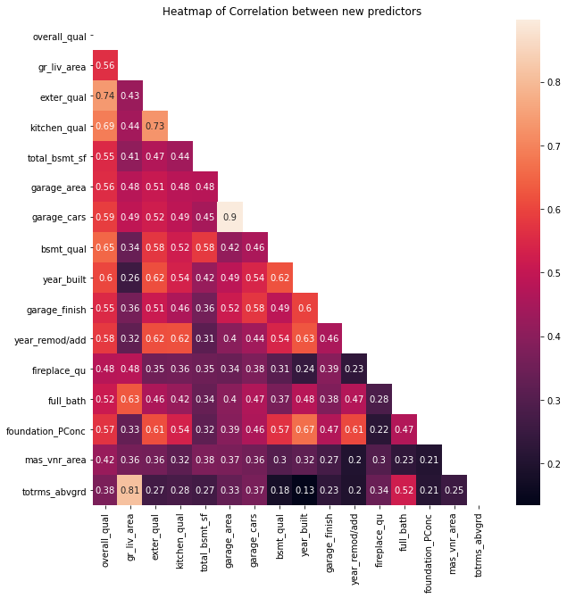

There are some variables that have very high correlation:
   - Overall quality with External quality at 0.74
   - Overall quality with kitchen quality is 0.69
   - Overall quality with Basement quality is 0.65
   - Overall quality with Fireplace quality is 0.48
   
 Here are some findings:
 
 I will only retain overall quality as they are all pointing to quality and assuming that overall quality has all the other quality variables callibrated into it.
 
   
   - Garage area and garage cars at 0.90
 
 
 I will retain garage area as both are pointing to the size of the garage.

   - Year Built and Year remod/add at 0.63

I will retain year remod/add as it is the update year that the house has last been remod/add. I have ensure that if there were no remod/add done, it will retain as the year that was built.

 There seem to be a high correlation between **'Total rooms above grade'** and **'Above grade (ground) living area square feet'**. However,  it is also possible to have less rooms with huge area spaces and vice versa, therefore I will retain both variables.

#### Here are the finalize predictors

|Features|Correlation|
|---|---|
|overall_qual|0.803462|
|gr_liv_area|0.719463|
total_bsmt_sf|0.665116
garage_area|0.655097
garage_finish|0.558566
year_remod/add|0.550872
full_bath|0.538225
foundation_PConc|0.529500
mas_vnr_area|0.511273
totrms_abvgrd|0.509775

#### Finalize Data Dictionary

|Features|Description|
|---|---|
|overall_qual|Rates the overall material and finish of the house|
|gr_liv_area|Above grade (ground) living area square feet|
|total_bsmt_sf|Total square feet of basement area|
|garage_area|Size of garage in square feet|
|garage_finish|Interior finish of the garage|
|year_remod/add|Remodel date (same as construction date if no remodeling or additions)|
|full_bath|Full bathrooms above grade|
|foundation_PConc|Type of foundation: Poured Contrete|
|mas_vnr_area|Masonry veneer area in square feet|
|totrms_abvgrd|Total rooms above grade (does not include bathrooms)|

##### Distribution of the finalize predictors

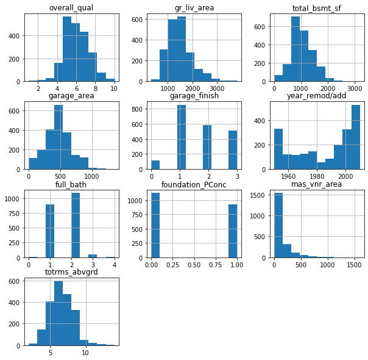

##### Heatmap of the correlation between finalize predictors

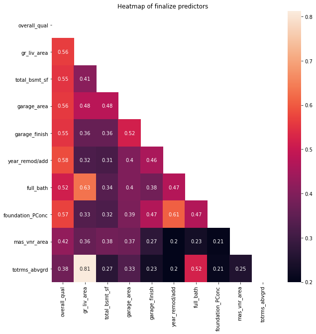

---

## Summary

4 Models were created and here are the results below:

|Model|Set|R^2|Cross Val Score|RMSE|
|---|---|---|---|---|
|Overfit|Test| 0.9152|0.8901|23151|
|Overfit|Train| 0.9303|0.8901|20904|
|Baseline|Test|0.8593|0.8234|29822|
|Baseline|Train|0.8311|0.8234|32541|
|Model 2|Test|0.9017|0.8640|24925|
|Model 2|Train|0.8895|0.8640|26315|
|**Model 3**|**Test**|**0.9049**|**0.8767**|**24511**|
|**Model 3**|**Train**|**0.8815**|**0.8676**|**27255**|
|Model 4|Test| 0.9033|0.8678|24721|
|Model 4|Train|0.8808|0.8678|27334|

Baseline - using the finalized features

Model 2 - Baseline with Polynomial Feature and Standard Scaler

Model 3 - Model 2 with Ridge regularization

Model 4 - Model 2 with Lasso regularization

We officially started off with the baseline model narrowing down to correlated variables as our predictors with correlation above 0.5 & below -0.5. However we did not come across any -0.5 correlated variables. The statistics used in this regression to evaluate model fit were R^2 and RMSE. R^2 is the proportional improvement in prediction from the regression model, indicates the goodness of fit of the model. RMSE is the square root of the variance of the residuals. It indicates the absolute fit of the model to the data–how close the observed data points are to the model’s predicted values. Lower values of RMSE indicate better fit.9

The baseline model came back with R^2 of 0.8593(test), 0.8311(training), 0.8234(CVscore). From the scores we can interpret that the model is well fitted as they are fairly similar. The RMSE on the other hand return 29,822(test) and 32,541(training), what this means is that there will be an approximated (+/-) error(RMSE) from the mean. 
This sets the benchmark of our models and we aim to further improve by increasing the R^2 and lowering the RMSE. Best would be we could reach somewhere close to the scores of the overfitted model without overfitting.   

Model 2 is a modification of the baseline model, introducing interactive terms and scaling. Interactive terms were created using PolynomialFeature with interactive only set to true as I am unsure how to infer predictor^2. The predictors were all scaled to Z-scores using StandardScalar. The R^2 scores for both sets improved to 0.9017(test), 0.8895(training) and 0.8640(CVscore), the model continues to be well fitted. RSME also improved with 24,925(test) and 26,315(training). That was an approximate USD 5000 decrease in the RMSE for both sets. However, this might be due to the added predictors with the interactive terms resulting the model to be overfitted. 

Model 3 is an enhanced version of model 2 with Regularization. Regularization is a method for "constraining" or "regularizing" the size of the coefficients, thus "shrinking" them towards zero. It reduces model variance and thus minimizes overfitting. If the model is too complex, it tends to reduce variance more than it increases bias, resulting in a model that is more likely to generalize. For model 3 , ridge regularization was applied to the model to shrink the coefficients by bringing it close to 0. Model 3 scores were further improved with R^2 at 0.9049(test), 0.8815(training) and 0.8676(CVscore) and RMSE at 24,511(test) & 27,255(training). The R^2 scores in general were still relatively consistent and continue to show that it is a good fit. RMSE has also taken another dip of approximately USD 1,000.

Model 4 similarly like model 3 is an enhanced version of model 2 but using Lasso Regularization instead. Ridge regularization shrinks the coefficients by bringing it close to 0 but Lasso shrinks the coefficients by directing it towards 0. Model 4 returns fairly similar results to Model 3 with R^2 at 0.9033(test) ,0.8808(training) and 0.8678(CVScore) & RMSE at 24,721(test) and 27,334(training).

---

## LINEM Assumptions

### Assumptions for the chosen model (Model 3)

#### Linearity

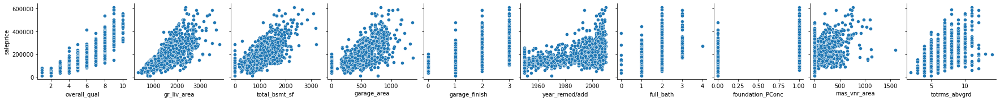

#### Independence

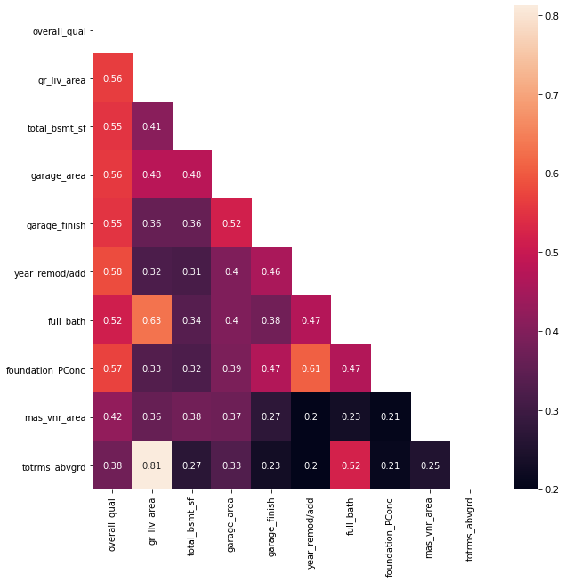

#### Normality

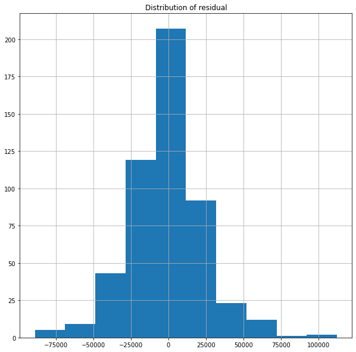

#### Error of variance

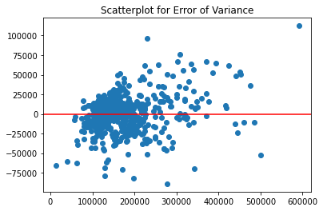

#### Multicollinearity

Model 3 was with regularization therefore, multicollinearity would have been handled.

### Accuracy of model

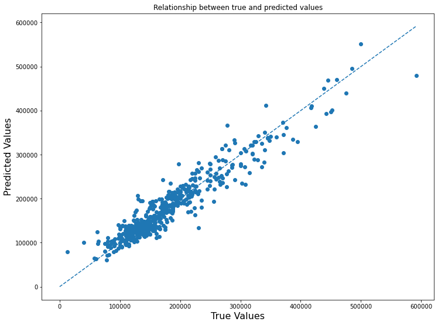

---

## Conclusion

In conclusion, with the baseline model enginnered with polynomialfeature to create interactive terms, scaling and ridge regularization. We came up with model 3 which returned the best results, both R^2 and RMSE was pretty close to the overfitted set. Most importantly, with the test R^2 score of model 3: we achieve an accuracy of **90.4%**  which is slightly higher than our goal, 85% accuracy, hooray! This will enable real estate agents to engage home sellers/buyers with better house prices using the features that were recommended, mitigating the misconception of real estate agents. Future plans for this would be to explore by removing features that return negative coefficient to see if there will be a improvement to the model. With our current resources, Model 3 have been chosen to submit to Kaggle.

---

## Citations
 
1 [HG.org,(1995-2021) The Top Disputes between Buyer and Seller and How to Resolve Them
](https://www.hg.org/legal-articles/the-top-disputes-between-buyer-and-seller-and-how-to-resolve-them-43415)
 
2[Mclarty Wolf,(2018) What If the Seller Misrepresented the Condition of the Property?](https://www.mclartywolf.com/seller-misrepresented-condition-property/)
 
3[Ryan Ellis,(2019) See you in court! 10 ways agents typically get slapped with lawsuits](https://www.inman.com/2019/09/25/see-you-in-court-10-ways-agents-typically-get-slapped-with-lawsuits/)
 
4 [David Streitfeld,(2008) Feeling Misled on Home Price, Buyers Sue Agent](https://www.nytimes.com/2008/01/22/business/22agent.html)
 
5[Katie Comstock,(2019) Can You Sue Your Realtor for Selling Your House at Too Low a Price?](https://levy-law.com/2019/07/12/can-you-sue-your-realtor-for-selling-your-house-at-too-low-a-price/)
 
6,7 [Rohit Sharma,(2020) 4 Types of Data: Nominal, Ordinal, Discrete, Continuous](https://www.upgrad.com/blog/types-of-data/)
 
8[Dean De Cock,(2015) Ames Iowa: Alternative to the Boston Housing Data Set](http://jse.amstat.org/v19n3/decock/DataDocumentation.txt)
 
9[Karen Grace-Martin,(2008–2021) Assessing the Fit of Regression Models
](https://www.theanalysisfactor.com/assessing-the-fit-of-regression-models/)
 